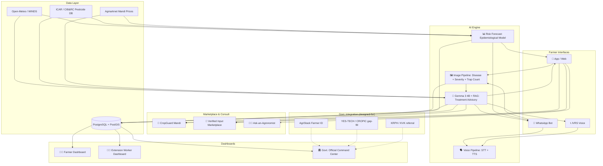

# 🏆 SIH Winning Strategy: CropGuard — AI Crop Health & Market Intelligence Platform

> **Problem Statement**: Early detection and management of crop diseases and pest infestations
> **Focus**: Sugarcane & Cotton, Government of Maharashtra
> **This version**: IoT hardware removed · Marketplace, agronomist access, and government integration added

---

## 📌 How to use this document

This is the single source of truth for the build — everyone on the team works from this, and if you're feeding it to an AI coding agent (Antigravity or otherwise) to vibe-code the implementation, **feed it one module at a time, in the order given in "Build Priority" near the bottom** — not the whole file in one prompt. Each USP section has a fenced "Implementation" block written to be handed directly to a coding agent as its spec. The "Data Model" and "API Endpoints" sections are the ones to paste in first when scaffolding the backend.

---

## ⚠️ Scope change: no IoT hardware

The original plan included an ESP32-CAM pheromone trap with onboard object detection. **Cut — out of scope given time and hardware constraints.** We keep the *value* of trap-based pest counting without the electronics:

Instead of a camera continuously watching the trap, the farmer (or extension worker) photographs the trap's sticky card / counting tray on a schedule — every 3–4 days is standard practice anyway — and uploads it through the app or WhatsApp, exactly like a disease photo. A vision model counts pests in that image instead of a device counting them automatically. Same "pest-trap or sensor inputs" checklist item, same economic-threshold-level (ETL) logic, zero firmware, zero risk of a device failing on stage.

Wherever the old plan said "IoT trap," this version means **"trap photo upload."**

---

## 🎯 Checklist against the problem statement

| # | Required capability | Most teams | CropGuard |
|---|---------------------|------------|-----------|
| 1 | Image-based symptom ID | ✅ Basic | ✅ Multi-stage, with severity scoring |
| 2 | Pest-trap / sensor inputs | ❌ Ignored | ✅ Trap photo counter + ETL calculator (no hardware) |
| 3 | Weather-based risk forecasting | ⚠️ Simple alerts | ✅ Epidemiological risk model, 5 factors |
| 4 | Geospatial hotspot mapping | ⚠️ Basic pins | ✅ Wind-based pest migration corridor prediction |
| 5 | Expert validation | ❌ Ignored | ✅ Confidence-routed triage + paid agronomist escalation |
| 6 | Multilingual advisories | ⚠️ Translation | ✅ Voice-first Marathi/Hindi, WhatsApp + IVRS |
| 7 | IPM recommendations | ⚠️ Generic | ✅ Prescription-style, with resistance-rotation warnings |
| 8 | Safe input usage | ⚠️ Ignored | ✅ PHI countdown + verified/cheaper input marketplace |
| 9 | Referral to extension/labs | ❌ Ignored | ✅ Nearest KVK/lab + designed-for KRPH hook |
| 10 | Follow-up monitoring | ❌ Ignored | ✅ Scheduled re-check photo, before/after comparison |
| 11 | Learn from field confirmations | ❌ Ignored | ✅ Active learning feedback loop |
| 12 | Dashboards for officials | ⚠️ Basic charts | ✅ District surveillance command center |

### Beyond the brief — bonus differentiators no one asked for but that win pitches

| Bonus feature | Why it's there |
|---|---|
| CropGuard Mandi (crop marketplace) | Turns good disease management into a better selling price — closes the loop from "detect" to "earn" |
| Verified & cheaper input marketplace | Attacks the counterfeit-pesticide problem directly named under "safe input usage" |
| Ask-an-Agronomist | Gives you a real answer to "how does this survive after the hackathon" |
| Government integration layer | Shows you designed around AgriStack/PMFBY instead of ignoring them — a govt panel notices this |

Put a slide in the deck that is literally this checklist. Judges score against the problem statement, not against how cool the tech is.

---

## 🎯 Core USPs (carried over, hardware removed)

### USP 1: 🔬 Disease Progression Timeline — Staging, Not Just Detection

**What everyone does**: "This is Red Rot" → generic treatment.

**What you do**:
- Detect the disease **and its severity stage** (Early / Moderate / Severe / Critical)
- Show a visual progression timeline: "You're at Stage 2. Here's what Stage 3 looks like in 3–5 days if untreated"
- Treatment recommendation changes with stage
- Ask for a **follow-up photo in 3 days**, compare before/after, report improvement or escalate

**Why this wins**: directly answers "follow-up monitoring," which almost nobody builds.

**Implementation**:
```
Image → Gemma 3 4B (multimodal: handles image + text in one model)
      → severity stage (1–4) via prompt-conditioned classification or a small regression head
      → Gemma RAG → stage-specific treatment (ICAR/SAU guideline corpus)
      → scheduled notification for re-check photo (3–5 days out)
      → compare before/after severity → improvement report or expert escalation
```

---

### USP 2: 🪤 Trap Photo Counter + ETL Calculator (replaces IoT trap)

**The problem statement explicitly says "pest-trap or sensor inputs."** Almost nobody will address this without hardware — you address it with a camera phone.

**What you do**:
- Farmer photographs the pheromone trap's sticky card every 3–4 days (standard practice — five traps per hectare, this digitizes a step that already happens on paper)
- Vision model counts pests of the relevant species in the photo
- App compares count against the crop-specific **Economic Threshold Level (ETL)** and tells the farmer plainly: spray now, or don't — you haven't crossed the threshold yet
- **Resistance-rotation warning**: if the same active-ingredient class was used in the last N days, flag it. This is not academic for Maharashtra cotton — Bt-resistant pink bollworm is a story of exactly this failure mode.
- Trap counts feed into the risk forecast model (USP 3) as a real input, not just a display number

**Why this wins**: turns unnecessary spraying into a data-backed decision, which is exactly what "more targeted pesticide use" in the expected outcomes means. Zero hardware risk for the demo.

**Implementation**:
```
TrapCount = {crop_id, photo_url, pest_species, count, etl_threshold_for_crop_stage, action_needed: bool}
count = vision_model(photo)  # fine-tune on a bollworm-in-trap dataset (public datasets exist for this — search "BOLLWM dataset")
action_needed = count > etl_threshold_for(crop, stage, pest_species)
resistance_flag = same_active_ingredient_used_within(days=14, crop_id)
→ surfaced in the Prescription card (USP 5) and feeds RiskScore (USP 3)
```

---

### USP 3: 🌡️ Epidemiological Risk Forecasting

**What everyone does**: "It will rain tomorrow, spray fungicide."

**What you do**: combine five factors into one disease-specific daily score, *before* symptoms appear:

```
Risk Score = f(Weather, Crop Stage, Variety Susceptibility, Soil Condition, Regional Pest/Disease History)
```

| Factor | Data source | Example |
|---|---|---|
| Weather | Open-Meteo (free, no key) for the demo; WINDS (PMFBY's own hyperlocal weather station network, already deploying to block/gram-panchayat level) as the designed-for production source | High humidity + 25–30°C sustained = red rot risk ↑ |
| Crop stage | Farmer's sowing date → growth calendar | Tillering stage = shoot borer peak |
| Variety | Farmer registers variety (Co-86032, etc.) | Some varieties are red-rot resistant |
| Soil | Farmer self-reported soil type/drainage (Soil Health Card API access is inconsistent — don't depend on it live) | Waterlogged = wilt risk ↑ |
| Regional history | Your own platform's confirmed reports, geo-clustered | "Pink bollworm reported 5km away last week" |

**Output**: daily Crop Health Score (0–100), color-coded 🟢🟡🟠🔴.

**Why this wins**: this is "early detection" done right — predicting disease before it appears, which is the literal gap the problem statement calls out ("these inputs are rarely combined into actionable farm-level alerts").

---

### USP 4: 🗺️ Pest Migration Corridor Prediction

**What everyone does**: pin diseases on a map.

**What you do**: overlay wind direction/speed on confirmed-case density to predict *where an outbreak is going*, not just where it's been — "whitefly population moving NE at ~5km/day, may reach your area in 2–3 days, start yellow sticky traps now."

**Why this wins**: turns hotspot mapping from decoration into a resource-allocation tool for extension officers, which is what the dashboard requirement is actually asking for.

**Implementation**: Leaflet.js + OpenStreetMap; confirmed reports → geocoded points → kernel density heatmap; wind data overlay → simple distance-decay diffusion vector, not a full PDE model — this doesn't need to be sophisticated to be genuinely differentiated, since almost nobody else will attempt it at all.

---

### USP 5: 📋 Prescription-Style Advisory

**What everyone does**: "Use Carbendazim."

**What you do**: a prescription-card advisory —

```
DIAGNOSIS: Red Rot (Stage 2/4) — Confidence: 87% ⚠️ expert review requested
TREATMENT:
 1. IMMEDIATE — Remove & burn infected stalks; Carbendazim 50% WP, 2g/L foliar spray
    Safety: 🟢 Low toxicity | PHI: 15 days | Resistance check: ✅ clear | Cost: ~₹350/acre
    [ Buy this — 3 verified sellers from ₹310/acre ]  ← links to USP 9
 2. BIOLOGICAL — Trichoderma viride soil application | 🟢 Organic | ~₹200/acre
 3. CULTURAL — improve drainage; avoid ratoon from infected crop
RE-CHECK: photo due 10-Sep-2026
REFERRAL: Nearest KVK/lab · Kisan Call Centre (KRPH 14447)
[ Talk to an agronomist — ₹30 ]  ← links to USP 10
TOTAL COST: ~₹550/acre | Expected yield recovery: 60–70%
```

**Why this wins**: addresses safe input usage (PHI + resistance flag), referral to extension/labs, and integrated management (chemical + biological + cultural) in one artifact, plus it now links straight into the marketplace and consult features instead of dead-ending as a static recommendation.

---

### USP 6: 🗣️ Zero-Download WhatsApp + Voice Interface

- **WhatsApp**: photo in → prescription card back; voice note in Marathi → STT → Gemma RAG → TTS → voice reply
- **IVRS fallback**: toll-free number, voice menu, works on any ₹3000 phone, no app or data plan needed
- No download friction — this is the accessibility USP, and it matters as much to judges as the model does

**Implementation**: WhatsApp Business API via Gupshup (Indian company, easier compliance, free tier); Whisper for STT; gTTS/Google Cloud TTS for Marathi.

---

### USP 7: 🔄 Active Learning from Field Confirmations

- After treatment, ask: "Did it work? 1-Yes 2-No 3-Partially"
- "No" → escalate to an agronomist (USP 10) and flag the image for retraining
- Flagged images queued for expert labeling → periodic fine-tune → model gets hyper-localized to Maharashtra crops over time
- This is the literal "learn from field confirmations" requirement, and it's also your data flywheel story

---

## 🆕 New USPs

### USP 8: 🏪 CropGuard Mandi — Crop Marketplace, Buy & Sell, With Recommendations

**What a plain marketplace does**: a listing board — farmer posts crop and price, buyer browses.

**What makes yours different**: it's powered by data your own app already collected, which no generic marketplace (or any competitor building disease detection alone) can claim.

- **Quality Score** on every listing, computed from the farmer's own diagnosis history: disease-free days, confirmed-resolved treatments, PHI compliance (no "harvested too soon after spraying" flags). This is a real trust signal for a buyer, not a self-reported claim.
- **Price recommendation**: pull nearby mandi/APMC prices (Agmarknet public price data) and suggest a fair asking range instead of leaving the farmer to guess or accept a trader's first offer.
- **Buyer-side ranking**: listings ranked for each buyer by a simple weighted score, not a flat list.
- **Pooling suggestion**: nearby farmers with similar crop, grade, and harvest week get notified to pool into one listing — an individual small farmer can't interest a large trader, a pooled lot can.

**Why this wins**: judges have seen "farmer marketplace" pitches before — the differentiator is that yours can prove quality from real monitoring data instead of a farmer's word, and it gives the diagnosis feature a payoff beyond "avoided some crop loss": good crop management now visibly earns a better price.

**Implementation**:
```
Listing = {farmer_id, crop_type, variety, quantity, grade, asking_price, quality_score, geo, harvest_date, photos, status}
QualityScore = f(disease_free_days, confirmed_treatments_resolved, phi_compliance_flag) → 0–100
PriceRecommendation = lookup Agmarknet/eNAM price for (crop, district, ~date) → suggested range
BuyerFeed = listings sorted by (0.4·quality_score + 0.35·proximity_score + 0.25·price_fit)
PoolingSuggestion = cluster(open_listings) by (crop, grade, harvest_week, geo_radius≤10km) → notify matched farmers
```

---

### USP 9: 🧪 Verified & Cheaper Input Marketplace

**What you do**: every treatment recommendation in the prescription card ends in a "Buy this" button showing 2–3 verified sellers and prices — turning a recommendation into a safe completed purchase instead of a product name the farmer has to go hunt for from whichever dealer is nearest (and might sell them a counterfeit).

- Sellers register with basic verification (dealer license number, CIB&RC product registration reference)
- Price comparison across verified sellers, so genuine products can compete with the price gap that makes counterfeit products attractive in the first place
- Stretch: batch/QR lookup against a product's registration number to flag suspicious listings

**Why this wins**: counterfeit and spurious pesticides are a large, real, ongoing problem in India — independent industry estimates put them at roughly a quarter to a third of the market by value, with Maharashtra named among the affected states, and it's still happening (as recently as August 2025 the Union Agriculture Minister was responding to fresh crop damage from fake pesticides). This sits squarely inside "safe input usage," which the problem statement names explicitly — it's not a bolted-on shopping feature.

**Implementation**:
```
Seller = {name, license_no, cib_registration_ref, verified_status, location}
InputProduct = {name, active_ingredient, cib_registration_no, category}
InputListing = {seller_id, product_id, price, stock, unit}
"Buy this" on prescription card → filter InputListing by recommended active_ingredient → sort by price
```

---

### USP 10: 👩‍🌾 Ask-an-Agronomist — Cheap, Direct Expert Access

**What you do**: a paid-but-cheap (₹20–50) chat, voice-note, or short call with a verified agronomist — cheaper than a private consultation, and reachable from the same screen as the diagnosis, not a buried support menu.

- Two entry points: **automatic escalation** (AI confidence is low, or the farmer says a diagnosis didn't help) and **always-on** (an "Ask an agronomist" button visible everywhere, for reassurance beyond what the app can tell them)
- Agronomist pool: retired KVK staff, agricultural university students/interns, licensed private consultants — gives you a supply side and a genuine social-impact/income angle worth mentioning to judges
- The nominal fee also gives you a real answer to "how does this survive after the hackathon" — a question judges genuinely ask, and most teams have no answer for

**Why this wins**: strengthens "expert validation" by turning a routing queue into something people would actually pay for, and it's a business-model slide that isn't hand-waved.

**Implementation**:
```
Agronomist = {name, credentials, kvk_affiliation?, rating, availability}
ConsultationSession = {farmer_id, agronomist_id, diagnosis_id?, channel: chat|voice|video, fee, status}
Escalation trigger: diagnosis.confidence < threshold OR farmer_feedback == "didn't help" → offer consult
MVP channel: text chat (cheapest to build first). Stretch: voice-note exchange. Further stretch: Jitsi video embed.
Payment: Razorpay/UPI test mode is enough for a demo — don't build a full wallet system.
```

---

### USP 11: 🏛️ Government Integration Layer (designed-for, not fully wired up)

**What everyone does**: says "we'll integrate with government APIs" with no specifics.

**What you do**: name the actual systems, and be precise about what each gives you.

- **AgriStack Farmer Registry** — use the farmer's existing 11-digit Farmer ID (linked to Aadhaar + land records, already live in Maharashtra) as your identity layer instead of building a parallel one.
- **WINDS** — PMFBY's own hyperlocal weather station network (block/gram-panchayat level AWS + rain gauges); a better data source than a generic API for the risk model, once access is available. Open-Meteo is the honest fallback for the demo.
- **YES-TECH / CROPIC** — PMFBY's satellite-based yield estimation has a documented blind spot: it can miss localized, on-the-ground damage. Farmers have reported exactly this. Your ground-level, geo-tagged disease reports are the complementary data layer that gap needs — this is your strongest line to a government panel, don't undersell it.
- **KRPH / Kisan Call Centre** — route unresolved or lab-required cases to the existing toll-free grievance/helpline infrastructure (14447) instead of inventing a parallel call center.

**Why this wins**: for a state-government problem statement, showing you designed *around* the systems that already exist — rather than ignoring them — is one of the most reliable ways to land with a panel that includes actual officials.

**Implementation**: no live wiring needed for the demo — reserve the fields (`agristack_farmer_id`, `winds_station_ref`) in the data model, and put one clear architecture slide showing exactly where each system plugs in. Say "designed for integration" in the pitch; don't fake a live call.

---

### USP 12 (bonus, cheap to build): 📅 Community Pest Calendar

Group your own historical reports by taluka and week-of-year — no ML needed, just a `GROUP BY` — to show "pink bollworm typically starts appearing in your taluka around this week" before any report comes in this season. Seed it with any public historical advisories (ICAR/KVK bulletins) you can find so it isn't empty on day one. Cheap, and nobody else will think to add it.

---

## 🏗️ Updated System Architecture



---

## 🗄️ Data Model (core entities — hand this to the coding agent first)

```
Farmer          { id, name, phone, village, taluka, district, agristack_farmer_id?, language_pref }
Crop            { id, farmer_id, crop_type, variety, sowing_date, plot_size, plot_geo }
Diagnosis       { id, crop_id, photo_url, disease, severity_stage, confidence, status: auto|expert_reviewed, created_at }
TrapCount       { id, crop_id, photo_url, pest_species, count, etl_threshold, action_needed: bool, created_at }
RiskScore       { id, crop_id, date, score_0_100, factors: {weather, stage, variety, soil, history} }
HotspotReport   { id, diagnosis_id, geo_point, disease, confirmed_by: farmer|expert }
Prescription    { id, diagnosis_id, treatment_steps[], phi_days, resistance_flag, cost_estimate, expected_recovery_pct }
Agronomist      { id, name, credentials, kvk_affiliation?, rating, availability }
ConsultationSession { id, farmer_id, agronomist_id, diagnosis_id?, channel, fee, status }
MarketListing   { id, farmer_id, crop_type, grade, quantity, asking_price, quality_score, geo, harvest_date, status }
Seller          { id, name, license_no, cib_registration_ref, verified_status, location }
InputProduct    { id, name, active_ingredient, cib_registration_no, category }
InputListing    { id, seller_id, product_id, price, stock, unit }
Order           { id, type: crop|input, buyer_ref, listing_id, status, price }
```

---

## 📱 Screens Needed

**Farmer app/web**: Home (my crops) · Take photo → prescription card · Trap photo upload → count/ETL result · Risk score & alerts feed · CropGuard Mandi (my listings / browse) · Input marketplace (buy from prescription) · Ask an agronomist (book/chat) · Follow-up reminders & history

**Buyer view** (can be a lightweight shared web page — doesn't need its own app): browse/filter listings by crop, quality score, location, price · contact/order

**Extension worker dashboard**: assigned/nearby case queue (sorted by confidence + severity) · case review & override · visit route from hotspot model

**Government official dashboard**: district hotspot map · trend charts by disease · resource-allocation view · aggregate quality-score / marketplace activity (optional)

---

## 🔌 API Endpoints (sketch)

```
POST /diagnoses                        upload photo → diagnosis + prescription
POST /trap-counts                      upload trap photo → count + ETL verdict
GET  /risk-score/:crop_id              current + forecast risk score
POST /hotspot-reports                  log confirmed case for the map
GET  /hotspots?district=               map data
POST /consultations                    book an agronomist session
GET  /agronomists?available=true
POST /market/listings                  create a crop listing
GET  /market/listings?crop=&district=&sort=recommended
POST /market/orders
GET  /inputs/products/:id/sellers      verified sellers + prices for a product
POST /feedback                         farmer confirms/rejects outcome (active learning)
```

---

## 📱 Tech Stack

| Layer | Technology | Why |
|---|---|---|
| App/Web | Flutter, or a responsive web app if faster to ship | cross-platform / fastest for hackathon time |
| WhatsApp Bot | Gupshup API | Indian, easier compliance, free tier |
| Backend | FastAPI (Python) | async, ML-friendly |
| Database | PostgreSQL + PostGIS | geospatial queries for heatmaps |
| Image + advisory model | Gemma 3 4B (multimodal — handles image and text in one model) + RAG | already built by your friend |
| Voice | Whisper (STT) + gTTS / Google Cloud TTS | best Marathi support |
| Weather | Open-Meteo (demo) · WINDS (designed-for) | free, no key / real hyperlocal govt data |
| Mandi prices | Agmarknet / eNAM public price data | powers Mandi price recommendation |
| Maps | Leaflet.js + OpenStreetMap | free, no API key |
| Payments | Razorpay/UPI test mode | consult fee + input marketplace orders |
| Video/chat | WebSocket text chat (MVP) → Jitsi embed (stretch) | agronomist consult |
| Hosting | Google Cloud / Render free tier | student credits |
| CI/CD | GitHub Actions | free |

---

## 🏁 Build Priority (updated — no IoT sprint)

### Sprint 1 — Core MVP
- [ ] Image diagnosis + severity scoring (Gemma 3 4B + RAG)
- [ ] Prescription card (treatment, PHI, cost, resistance flag)
- [ ] Farmer registration (crop, variety, location, sowing date)
- [ ] Risk score engine (weather + crop stage)

### Sprint 2 — Differentiators
- [ ] WhatsApp bot integration
- [ ] Voice input/output in Marathi
- [ ] Trap photo upload + count + ETL calculator
- [ ] Geospatial heatmap + follow-up photo monitoring

### Sprint 3 — Marketplace & Access
- [ ] CropGuard Mandi: listing creation, quality score, price recommendation, buyer browse
- [ ] Verified input marketplace: seller listings + "buy this" CTA from prescription card
- [ ] Ask-an-agronomist: booking + chat MVP
- [ ] Active learning feedback loop (confirm/reject diagnosis)

### Sprint 4 — Government Value & Polish
- [ ] Extension worker + official dashboards
- [ ] Pest migration corridor prediction
- [ ] AgriStack/WINDS/YES-TECH integration points (data fields + one architecture slide)
- [ ] Demo rehearsal, deck, video

---

## 🎭 Demo Script (5 minutes)

| Time | Action | Impact |
|---|---|---|
| 0:00–0:30 | A farmer discovers red rot too late, loses 40% yield | Emotional hook |
| 0:30–1:15 | Live: photo of diseased leaf → prescription card with severity, treatment, cost, PHI, "buy this" | Core value |
| 1:15–1:45 | Trap photo → pest count → ETL verdict ("below threshold, don't spray yet") | Sensor-input requirement, no hardware needed |
| 1:45–2:20 | WhatsApp + voice note in Marathi → same result | Accessibility USP |
| 2:20–2:50 | Risk score shifts 🟢→🟠 from weather + nearby outbreak → proactive alert; hotspot/corridor map | Early-detection USP |
| 2:50–3:20 | CropGuard Mandi: a listing with quality score + price recommendation; "Ask an agronomist — ₹30" | New value: earn more, get help cheap |
| 3:20–3:50 | Government dashboard + the AgriStack/WINDS/YES-TECH integration slide | Government-panel value |
| 3:50–4:20 | Farmer confirms outcome → feedback loop → model improves | Sustainability story |
| 4:20–5:00 | Checklist slide: every requirement, mapped to a feature | Closing |

---

## 💡 Talking Points for Judges

1. "We don't just detect — we predict." Five-factor epidemiological model alerts before disease appears.
2. "Zero-download accessibility." WhatsApp and voice calls, no app needed, works on a ₹3000 phone.
3. "Prescription, not just diagnosis." Stage-specific treatment, safety ratings, cost, re-check date, lab referral.
4. "The model gets smarter with every farmer." Active learning creates a data flywheel unique to Maharashtra crops.
5. "Good crop management now pays literally." The Mandi quality score turns a clean diagnosis history into a better market price.
6. "A real agronomist, for the price of a cup of tea." Not a chatbot pretending to be one — an actual paid escalation path.
7. "We designed for the systems that already exist." AgriStack, WINDS, YES-TECH — named specifically, not hand-waved.
8. "We built what the problem statement asked for." Point to the checklist — you cover all 12 items; most teams cover 3–4.

---

> [!IMPORTANT]
> **The single most important thing**: map every feature back to the problem statement in the deck. Judges score against the brief, not against how impressive the tech sounds. Have one slide that is literally the checklist table above.
