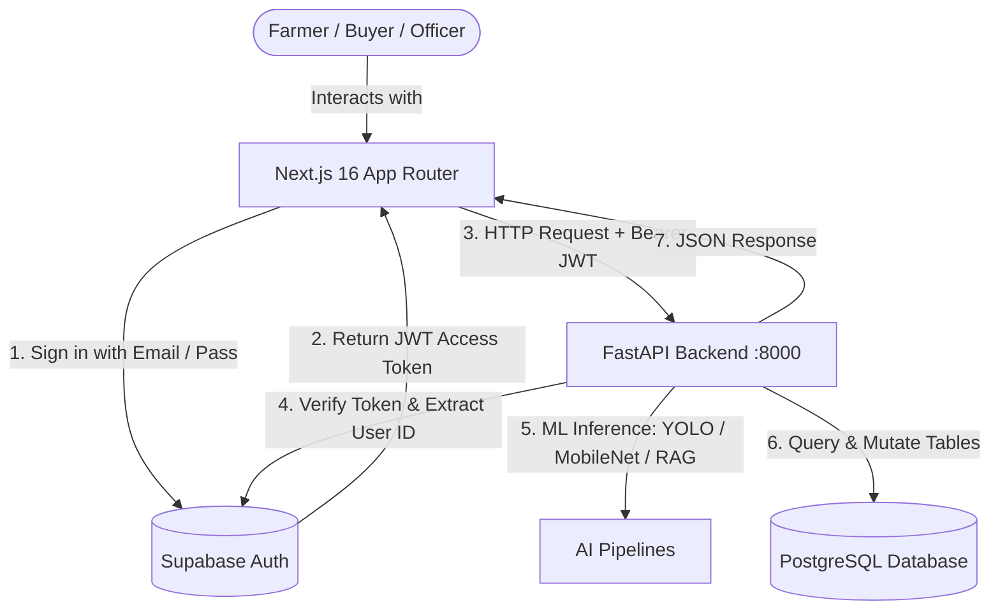

# 🌾 KisanX + CropGuard: Frontend Master Manual & Complete Backend Encyclopedia

> **Target Audience**: Antigravity AI Agent & Frontend Engineering Team  
> **Framework**: Next.js 16.3.4 (App Router, Turbopack, React 19)  
> **Styling**: Tailwind CSS v4, Custom Obsidian Glassmorphism Design System  
> **Auth & Database**: Supabase SSR (`@supabase/ssr`, `@supabase/supabase-js`)  
> **Backend Gateway**: FastAPI REST Services (`http://127.0.0.1:8000`)  
> **Live Test Suite**: 25/25 Tests Passing (100% Pass Rate)

---

## 📑 Table of Contents

1. [Architectural Overview & Connection Setup](#1-architectural-overview--connection-setup)
2. [Global Authentication & Token Injection Pattern](#2-global-authentication--token-injection-pattern)
3. [Design System & Obsidian Dark Theme Tokens](#3-design-system--obsidian-dark-theme-tokens)
4. [Exhaustive Backend API Reference (All 43 Endpoints)](#4-exhaustive-backend-api-reference-all-43-endpoints)
   - [Domain 1: System & Health (2 Endpoints)](#domain-1-system--health)
   - [Domain 2: Authentication & Profile Sync (1 Endpoint)](#domain-2-authentication--profile-sync)
   - [Domain 3: Farm & Crop Cycle Management (3 Endpoints)](#domain-3-farm--crop-cycle-management)
   - [Domain 4: Disease Diagnostics & Prescriptions (4 Endpoints)](#domain-4-disease-diagnostics--prescriptions)
   - [Domain 5: Pest Trap Counts & ETL Thresholds (2 Endpoints)](#domain-5-pest-trap-counts--etl-thresholds)
   - [Domain 6: Dynamic Risk Scoring (1 Endpoint)](#domain-6-dynamic-risk-scoring)
   - [Domain 7: Regional Outbreak Hotspots & Heatmap (2 Endpoints)](#domain-7-regional-outbreak-hotspots--heatmap)
   - [Domain 8: CropGuard Mandi Listings & Orders (5 Endpoints)](#domain-8-cropguard-mandi-listings--orders)
   - [Domain 9: Direct Crop Marketplace & Quality Certification (10 Endpoints)](#domain-9-direct-crop-marketplace--quality-certification)
   - [Domain 10: Verified Agri-Inputs Marketplace (3 Endpoints)](#domain-10-verified-agri-inputs-marketplace)
   - [Domain 11: Ask-an-Agronomist Consultations (4 Endpoints)](#domain-11-ask-an-agronomist-consultations)
   - [Domain 12: Farmer Feedback Loop & Retraining (2 Endpoints)](#domain-12-farmer-feedback-loop--retraining)
   - [Domain 13: Weather & Farm Intelligence Context (6 Endpoints)](#domain-13-weather--farm-intelligence-context)
   - [Domain 14: AI Assistant & Grounded RAG (3 Endpoints)](#domain-14-ai-assistant--grounded-rag)
5. [Frontend App Blueprint: What Exists vs What to Build](#5-frontend-app-blueprint-what-exists-vs-what-to-build)
6. [Reusable TypeScript API Client (`lib/api.ts`)](#6-reusable-typescript-api-client-libapits)
7. [Running & Verifying Locally](#7-running--verifying-locally)

---

## 1. Architectural Overview & Connection Setup

The KisanX frontend communicates with two backends:
1. **Supabase Cloud Project** (`https://eahcutkkosdvyztdmyot.supabase.co`):
   * Provides session management, OAuth, Magic Links, and persistent user profiles.
   * Supabase JWTs are passed directly to the FastAPI backend as `Authorization: Bearer <access_token>`.
2. **FastAPI Backend Gateway** (`http://127.0.0.1:8000`):
   * Runs all Computer Vision pipelines (YOLOv11 Instance Seg, MobileNetV3 Sugarcane Classifier).
   * Runs SentenceTransformers RAG vector retrieval.
   * Connects to Ollama Gemma 3 for multi-lingual clinical prescriptions.
   * Executes business logic across all 43 endpoints.



---

## 2. Global Authentication & Token Injection Pattern

Every authenticated request from Next.js to FastAPI must include:
```http
Authorization: Bearer <supabase_access_token>
```

### Next.js Client Hook to Fetch with Auth:
```typescript
// lib/fetchWithAuth.ts
import { createClient } from "@/lib/supabase/client";

const API_BASE = process.env.NEXT_PUBLIC_KISANX_API_URL || "http://127.0.0.1:8000";

export async function apiFetch<T>(endpoint: string, options: RequestInit = {}): Promise<T> {
  const supabase = createClient();
  const { data: { session } } = await supabase.auth.getSession();
  const token = session?.access_token;

  const headers = new Headers(options.headers || {});
  if (token) {
    headers.set("Authorization", `Bearer ${token}`);
  }
  if (!headers.has("Content-Type") && !(options.body instanceof FormData)) {
    headers.set("Content-Type", "application/json");
  }

  const res = await fetch(`${API_BASE}${endpoint}`, {
    ...options,
    headers,
  });

  if (!res.ok) {
    const errorBody = await res.json().catch(() => ({ detail: res.statusText }));
    throw new Error(errorBody.detail || `API Request Failed with status ${res.status}`);
  }

  return res.json() as Promise<T>;
}
```

### Pre-Seeded 1-Click Evaluation Credentials
For testing and evaluator demos without signup friction:
* **Farmer**: `cropguard_test@testing.dev` / `Test@CropGuard2026!`
* **Buyer**: `buyer@kisanx.com` / `Password123!`
* **Quality Inspector**: `officer@kisanx.com` / `Password123!`

---

## 3. Design System & Obsidian Dark Theme Tokens

The application employs a curated **Obsidian Glassmorphism** aesthetic optimized for outdoor field conditions:

* **Obsidian Background**: `#030604` (`bg-[#030604]`)
* **Card Surface**: `rgba(255, 255, 255, 0.03)` with `backdrop-blur-xl border border-white/10`
* **Emerald Vitality (Healthy / Safe / Certified)**: `#10B981` (`text-emerald-400`, `bg-emerald-500/10`)
* **Amber Warning (Moderate Risk / Pending Inspection)**: `#F59E0B` (`text-amber-400`, `bg-amber-500/10`)
* **Crimson Alert (Critical Pathogen / Threshold Breached)**: `#EF4444` (`text-rose-400`, `bg-rose-500/10`)
* **Teal Mandi (Trade / Price / Negotiation)**: `#14B8A6` (`text-teal-400`, `bg-teal-500/10`)

---

## 4. Exhaustive Backend API Reference (All 43 Endpoints)

---

### Domain 1: System & Health

#### 1. `GET /` — Root Status
* **Auth**: None (Public)
* **Headers**: None
* **What It Takes**: Nothing
* **What It Gives**:
  ```json
  {
    "status": "ok",
    "service": "kisanx-api",
    "version": "1.0.0"
  }
  ```
* **How to Build in App**: Ping in application footer or health pulse component to show backend connectivity status (Green dot indicator).

#### 2. `GET /health` — Diagnostics & Ollama Liveness
* **Auth**: None (Public)
* **Headers**: None
* **What It Takes**: Nothing
* **What It Gives**:
  ```json
  {
    "status": "ok",
    "service": "kisanx-api",
    "version": "1.0.0",
    "ollama": {
      "base_url": "http://127.0.0.1:11434",
      "model": "gemma3:4b"
    }
  }
  ```
* **How to Build in App**: Displayed in the Admin / System Diagnostics panel or offline status banner.

---

### Domain 2: Authentication & Profile Sync

#### 3. `POST /api/auth/profile` — User Profile Synchronization
* **Auth**: Bearer JWT required
* **Headers**: `Authorization: Bearer <token>`, `Content-Type: application/json`
* **What It Takes**:
  ```typescript
  interface SyncProfileRequest {
    full_name: string;
    role?: "FARMER" | "BUYER" | "OFFICER";
    phone?: string;
  }
  ```
  ```json
  {
    "full_name": "Balwinder Singh",
    "role": "FARMER",
    "phone": "+91 98765 43210"
  }
  ```
* **What It Gives** (HTTP 200):
  ```json
  {
    "success": true,
    "user_id": "feca041a-59ff-497f-853b-fd6424f67445",
    "profile": {
      "id": "feca041a-59ff-497f-853b-fd6424f67445",
      "full_name": "Balwinder Singh",
      "role": "FARMER",
      "phone": "+91 98765 43210",
      "updated_at": "2026-09-08T19:00:00Z"
    }
  }
  ```
* **How to Build in App**: Call immediately in `app/auth/page.tsx` after Supabase `signInWithPassword()` or OAuth callback to ensure the backend profile table matches the authenticated identity.

---

### Domain 3: Farm & Crop Cycle Management

#### 4. `POST /api/farms/register` — Atomic Farm + Plot + Cycle Setup
* **Auth**: Bearer JWT required
* **Headers**: `Authorization: Bearer <token>`, `Content-Type: application/json`
* **What It Takes**:
  ```typescript
  interface FarmRegistrationPayload {
    farm: {
      name: string;
      village?: string;
      district?: string;
      latitude?: number;
      longitude?: number;
      area_acres: number;
    };
    plot: {
      name: string;
      area_acres: number;
      latitude?: number;
      longitude?: number;
      boundary?: any; // GeoJSON Polygon
    };
    crop_cycle: {
      crop_name: string; // "sugarcane" or "cotton"
      variety?: string;
      crop_stage?: string; // "planting" | "vegetative" | "tillering" | "harvest"
      planting_date?: string; // "YYYY-MM-DD"
      soil_type?: string; // "black_cotton" | "alluvial" | "loamy"
    };
  }
  ```
* **What It Gives** (HTTP 201):
  ```json
  {
    "success": true,
    "farm_id": "e1dadc8f-7f00-44b6-9759-186d702e114d",
    "plot_id": "72dd706c-2c0e-4127-840a-b0e549c2ee77",
    "crop_cycle_id": "0e943090-facf-4a7f-9186-7cc1de0b67a8"
  }
  ```
* **How to Build in App**: Render a 3-step Wizard in `app/dashboard/farm/new/page.tsx` (Step 1: Farm metadata + GPS pin; Step 2: Plot acreage + polygon drawer; Step 3: Crop species + planting calendar).

#### 5. `GET /api/farms` — List User's Registered Farms
* **Auth**: Bearer JWT required (Optional fallback for public explore)
* **Headers**: `Authorization: Bearer <token>`
* **What It Takes**: None
* **What It Gives** (HTTP 200):
  ```json
  {
    "success": true,
    "count": 1,
    "farms": [
      {
        "id": "e1dadc8f-7f00-44b6-9759-186d702e114d",
        "name": "Baramati Green Acres",
        "district": "Pune",
        "area_acres": 8.5,
        "plots": [
          {
            "id": "72dd706c-2c0e-4127-840a-b0e549c2ee77",
            "name": "Plot North",
            "area_acres": 4.0,
            "active_crop_cycle": {
              "id": "0e943090-facf-4a7f-9186-7cc1de0b67a8",
              "crop_name": "sugarcane",
              "variety": "Co 86032",
              "status": "ACTIVE"
            }
          }
        ]
      }
    ]
  }
  ```
* **How to Build in App**: Used on `app/dashboard/page.tsx` as the primary Farm Selector dropdown in the top header. Stores active `farm_id`, `plot_id`, and `crop_cycle_id` in React Context or Zustand.

#### 6. `GET /api/farms/{farm_id}` — Single Farm Details
* **Auth**: Bearer JWT required
* **Headers**: `Authorization: Bearer <token>`
* **What It Takes**: Path parameter `farm_id` (UUID)
* **What It Gives** (HTTP 200): Full single farm object with associated plot geometries.

---

### Domain 4: Disease Diagnostics & Prescriptions

#### 7. `POST /api/diagnoses` — AI Crop Scan & Prescription Generator
* **Auth**: Bearer JWT required
* **Headers**: `Authorization: Bearer <token>`, `Content-Type: multipart/form-data`
* **What It Takes** (FormData):
  * `file`: Binary leaf image (`.jpg`, `.jpeg`, `.png`, `.webp`, max 10MB)
  * `crop_cycle_id`: (string, optional) Active cycle UUID
  * `farm_id`: (string, optional) Farm UUID
  * `plot_id`: (string, optional) Plot UUID
  * `latitude`: (float, optional) Photo capture GPS latitude
  * `longitude`: (float, optional) Photo capture GPS longitude
* **What It Gives** (HTTP 201):
  ```json
  {
    "success": true,
    "diagnosis": {
      "id": "d9ff1ad5-8664-4bf8-b2a8-a53fe7a702b8",
      "disease": "Healthy",
      "confidence": 0.942,
      "severity_stage": 1,
      "photo_url": "https://eahcutkkosdvyztdmyot.supabase.co/storage/v1/object/public/scans/...",
      "status": "auto"
    },
    "prescription": {
      "id": "presc-8821",
      "treatment_steps": [
        {
          "type": "biological",
          "description": "Foliar application of Trichoderma viride @ 5g/liter.",
          "product": "Bio-Trichoderma",
          "dosage": "5g/L",
          "cost_per_acre": 350
        }
      ],
      "phi_days": 14,
      "expected_recovery_pct": 95.0,
      "recheck_date": "2026-09-15"
    }
  }
  ```
* **How to Build in App**: Implemented on `app/dashboard/scan/page.tsx` with HTML5 Camera Stream / Drag-and-drop file upload. Shows animated scanning laser, followed by split-view cards: Left = Annotated Image with Confidence Pill; Right = Clinical Prescription with Step-by-Step Medication & Pre-Harvest Interval (PHI) Countdown.

#### 8. `GET /api/diagnoses` — Diagnosis History
* **Auth**: Bearer JWT required
* **Headers**: `Authorization: Bearer <token>`
* **Query Params**: `limit` (int, default 20), `crop_cycle_id` (string, optional)
* **What It Gives** (HTTP 200):
  ```json
  {
    "success": true,
    "count": 4,
    "diagnoses": [...]
  }
  ```
* **How to Build in App**: Timeline list on the farmer dashboard showing past scans with disease badges, severity tags (Low, Moderate, High, Critical), and clickable links to view prescriptions.

#### 9. `GET /api/diagnoses/{diagnosis_id}` — Diagnosis Deep Dive
* **Auth**: Bearer JWT required
* **What It Takes**: Path param `diagnosis_id`
* **What It Gives** (HTTP 200): Full record including linked `prescription`, historical recovery notes, and agronomist second opinions if escalated.

#### 10. `POST /api/scans/create` — Universal Scan Ingestion
* **Auth**: Bearer JWT optional
* **Headers**: `Content-Type: multipart/form-data`
* **What It Takes**: FormData with `file`, `crop_name`, `farm_id`, `plot_id`.
* **What It Gives** (HTTP 200): Dispatches through `crop_router.py` to either MobileNetV3 or YOLOv11 and returns raw bounding boxes, masks, and disease percentage.

---

### Domain 5: Pest Trap Counts & ETL Thresholds

#### 11. `POST /api/trap-counts` — Pheromone Trap Monitoring & Threshold Check
* **Auth**: Bearer JWT required
* **Headers**: `Authorization: Bearer <token>`, `Content-Type: multipart/form-data`
* **What It Takes**:
  * `file`: Photo of physical sticky/pheromone trap sheet
  * `crop_cycle_id`: Active crop cycle ID
  * `pest_species`: Target pest (e.g., `pink_bollworm`, `stalk_borer`, `aphid`, `whitefly`)
  * `count`: (int, optional) Manual insect tally if farmer counts manually
* **What It Gives** (HTTP 200):
  ```json
  {
    "success": true,
    "trap_count": {
      "id": "tc-9912",
      "pest_species": "pink_bollworm",
      "count": 14,
      "etl_threshold": 8,
      "action_needed": true,
      "recommendation": "ETL Breach! 14 moths exceeds 8-moth threshold. Initiate immediate neem spray or pheromone lure replacement.",
      "created_at": "2026-09-08T19:20:00Z"
    }
  }
  ```
* **How to Build in App**: Dedicated Trap Tracker card on the dashboard with a speedometer gauge. If `action_needed === true`, display a pulsing red warning banner with one-click CTA to browse approved bio-pesticides in the inputs store.

#### 12. `GET /api/trap-counts/{crop_cycle_id}` — Trap History Trends
* **Auth**: Bearer JWT required
* **What It Takes**: Path param `crop_cycle_id`
* **What It Gives** (HTTP 200): Array of trap readings over time.
* **How to Build in App**: Line chart showing weekly insect population curve compared against the static red dashed ETL line.

---

### Domain 6: Dynamic Risk Scoring

#### 13. `GET /api/risk-score/{crop_cycle_id}` — 5-Factor Epidemiological Risk
* **Auth**: Bearer JWT required
* **Headers**: `Authorization: Bearer <token>`
* **What It Takes**: Path param `crop_cycle_id`
* **What It Gives** (HTTP 200):
  ```json
  {
    "crop_cycle_id": "0e943090-facf-4a7f-9186-7cc1de0b67a8",
    "score_date": "2026-09-08",
    "score": 50,
    "color_code": "yellow",
    "factors": {
      "weather": 65.0,
      "crop_stage": 40.0,
      "variety": 30.0,
      "soil": 45.0,
      "regional_history": 70.0
    },
    "recommendation": "Moderate risk: high morning relative humidity (82%) favors fungal sporulation. Inspect lower leaf canopy."
  }
  ```
* **How to Build in App**: Render a circular SVG progress gauge on the dashboard:
  * Green: 0–30 (Low Vulnerability)
  * Yellow: 31–60 (Moderate Watch)
  * Red: 61–100 (Severe Imminent Outbreak)
  Expandable accordion displays the 5 horizontal factor contribution bars (Weather, Stage, Variety, Soil, Outbreak History).

---

### Domain 7: Regional Outbreak Hotspots & Heatmap

#### 14. `POST /api/hotspot-reports` — Log Verified Field Outbreak
* **Auth**: Bearer JWT required
* **Headers**: `Content-Type: application/json`
* **What It Takes**:
  ```json
  {
    "diagnosis_id": "d9ff1ad5-8664-4bf8-b2a8-a53fe7a702b8",
    "latitude": 19.5682,
    "longitude": 74.2111,
    "disease": "RedRot",
    "confirmed_by": "farmer"
  }
  ```
* **What It Gives** (HTTP 201): Confirmation object with saved GPS coordinates.

#### 15. `GET /api/hotspots` — Outbreak Corridor Map Query
* **Auth**: Bearer JWT required
* **Headers**: `Authorization: Bearer <token>`
* **Query Params**:
  * `disease`: (string, optional) Filter by disease name (e.g. `RedRot`, `LeafCurl`)
  * `district`: (string, optional) District filter (e.g. `Ahmednagar`)
  * `days`: (int, default 30) Time window in days (1–365)
  * `limit`: (int, default 500)
* **What It Gives** (HTTP 200):
  ```json
  {
    "success": true,
    "count": 14,
    "time_window_days": 30,
    "disease_summary": {
      "RedRot": 9,
      "LeafCurl": 5
    },
    "reports": [
      {
        "id": "hs-01",
        "latitude": 19.5682,
        "longitude": 74.2111,
        "disease": "RedRot",
        "confirmed_by": "farmer",
        "created_at": "2026-09-08T18:00:00Z"
      }
    ]
  }
  ```
* **How to Build in App**: Mapbox GL or Leaflet / OpenStreetMap interactive radar view. Renders clustered red pulse heat circles. A filter pill bar toggles individual disease layers.

---

### Domain 8: CropGuard Mandi Listings & Orders

#### 16. `POST /api/market/listings` — Publish Mandi Lot
* **Auth**: Bearer JWT required
* **Headers**: `Content-Type: application/json`
* **What It Takes**:
  ```json
  {
    "crop_type": "Cotton",
    "variety": "Bt Shankar-6",
    "grade": "Grade A",
    "quantity": 25.0,
    "unit": "quintal",
    "asking_price": 7250,
    "district": "Rajkot",
    "latitude": 22.81,
    "longitude": 70.83
  }
  ```
* **What It Gives** (HTTP 201):
  ```json
  {
    "id": "3249ee79-f12b-42e1-a083-d9539304a081",
    "crop_type": "Cotton",
    "quality_score": 95,
    "asking_price": 7250,
    "status": "active"
  }
  ```

#### 17. `GET /api/market/listings` — Browse Mandi Marketplace
* **Auth**: Bearer JWT required
* **Query Params**: `sort` (`quality` | `price_asc` | `price_desc`), `crop_type`, `district`, `limit` (default 50)
* **What It Gives** (HTTP 200): Array of active harvest lots with quality scores, farmer names, distance calculation, and asking prices.

#### 18. `GET /api/market/listings/{listing_id}` — Listing Overview
* **What It Gives**: Single listing record with full grade verification.

#### 19. `PATCH /api/market/listings/{listing_id}` — Adjust Lot Price/Quantity
* **What It Takes**: `{ "asking_price": 7100, "quantity": 20 }`

#### 20. `POST /api/market/orders` — Place Purchase Intent Order
* **What It Takes**: `{ "order_type": "crop", "listing_id": "...", "quantity": 10 }`
* **What It Gives** (HTTP 201): Order receipt with calculated total valuation.

---

### Domain 9: Direct Crop Marketplace & Quality Certification

#### 21. `POST /api/marketplace/analyze-harvest` — Video Harvest Quality Audit
* **Auth**: Bearer JWT optional
* **Headers**: `Content-Type: multipart/form-data`
* **What It Takes**:
  * `file`: Drone or field walk-through video (`.mp4`, `.mov`, max 50MB) or high-res photo
  * `crop_name`: "Sugarcane" or "Cotton"
  * `farm_area_acres`: Area in acres (e.g. 5.0)
  * `variety`, `village`, `district`, `latitude`, `longitude`
* **What It Gives** (HTTP 200):
  ```json
  {
    "success": true,
    "crop_name": "Sugarcane",
    "variety": "Co 86032",
    "health_percentage": 94.2,
    "quality_grade": "Grade A (Export Ready)",
    "estimated_weight_quintals": 2850.0,
    "price_per_quintal": 365,
    "total_valuation": 1040250,
    "gemma_appraisal_summary": "High sucrose yield potential. Stalk internode elongation is optimal with dense canopy vigor.",
    "encryption_fingerprint": "0x8f19e4c3a2b75019d44f"
  }
  ```
* **How to Build in App**: Located at `app/market/page.tsx` under the "Upload Harvest" tab. Includes video player preview, frame extraction scrubber, and live valuation counter.

#### 22. `POST /api/marketplace/list` — Publish Certified Lot to Auction
* **What It Takes**: JSON payload with `ListingCreateRequest` (harvest metadata + appraisal summary).

#### 23. `GET /api/marketplace/listings` — Explore All Biddable Lots
* **What It Gives**: Global array of verified lots with negotiation status, photos, and inspection badges.

#### 24. `GET /api/marketplace/farmer-listings` — Farmer's Active Trade Portfolio
* **Query Params**: `?farmer_id=...`
* **What It Gives**: Farmer's own lots with counter-offers received.

#### 25. `GET /api/marketplace/inspector-queue` — Phytosanitary Officer Queue
* **What It Gives**: Uncertified lots requiring official quality approval.

#### 26. `GET /api/marketplace/sell-shop/threads` — Trade Chat Thread Directory
* **Query Params**: `?user_id=...`
* **What It Gives**: Array of active buyer-farmer direct negotiation rooms.

#### 27. `GET /api/marketplace/sell-shop/messages` — Conversation History
* **Query Params**: `?thread_id=...`
* **What It Gives**: Array of messages, price bids, and acceptance timestamps.

#### 28. `POST /api/marketplace/sell-shop/send` (or `/negotiate`) — Submit Counter-Offer
* **What It Takes**:
  ```json
  {
    "listing_id": "list-001",
    "sender_role": "buyer",
    "sender_name": "Shree Chhatrapati Mill",
    "proposed_price": 360,
    "message": "We can procure 2,000 quintals with direct transport pickup."
  }
  ```
* **What It Gives**: Appends message and updates thread status to `COUNTER_OFFER`.

#### 29. `POST /api/marketplace/certify` — Inspector Issuance of Quality Seal
* **What It Takes**:
  ```json
  {
    "listing_id": "list-001",
    "officer_name": "Dr. V. K. Deshmukh",
    "officer_id": "MH-884",
    "action": "CERTIFY",
    "notes": "Passed ICAR-FSSAI moisture and sucrose tests."
  }
  ```
* **What It Gives**: Locks the lot as `CERTIFIED_GRADE_A` and embeds cryptographic SHA-256 seal.

---

### Domain 10: Verified Agri-Inputs Marketplace

#### 30. `GET /api/inputs/products` — Catalog of Certified Farming Inputs
* **Query Params**: `category` (`pesticide` | `fertilizer` | `seed` | `bio_control`)
* **What It Gives**: Approved inventory list with CIB registration numbers and active ingredients.

#### 31. `GET /api/inputs/products/{product_id}/sellers` — Compare Nearby Dealers
* **What It Gives**: Regional merchants stocking this product sorted by distance and price per unit.

#### 32. `POST /api/inputs/sellers` — Input Merchant Onboarding
* **What It Takes**: `{ "name": "Kisan Seva Kendra", "license_no": "LIC-MH-2026-99", "district": "Ahmednagar", "phone": "..." }`

---

### Domain 11: Ask-an-Agronomist Consultations

#### 33. `GET /api/agronomists` — Directory of Agricultural Experts
* **Query Params**: `available` (bool, default true), `specialisation` (string, optional)
* **What It Gives**:
  ```json
  {
    "success": true,
    "count": 3,
    "agronomists": [
      {
        "id": "agro-01",
        "name": "Dr. Sunita Sharma",
        "credentials": "PhD Entomology, ICAR-CICR",
        "specialisation": "Cotton Pest Management & Bio-Control",
        "rating": 4.9,
        "fee_per_session": 30.0,
        "availability": true
      }
    ]
  }
  ```

#### 34. `POST /api/consultations` — Book Expert Session
* **What It Takes**:
  ```json
  {
    "agronomist_id": "agro-01",
    "diagnosis_id": "d9ff1ad5-8664-4bf8-b2a8-a53fe7a702b8",
    "channel": "chat"
  }
  ```
* **What It Gives** (HTTP 201): Booking confirmation with session ID.

#### 35. `GET /api/consultations/{session_id}` — Session Room Details
* **What It Gives**: Live consultation state and prescription annotations.

#### 36. `PATCH /api/consultations/{session_id}` — Update Session Status
* **What It Takes**: `{ "status": "completed", "notes": "Advised farmer to reduce nitrogen by 20%." }`

---

### Domain 12: Farmer Feedback Loop & Retraining

#### 37. `POST /api/feedback` — Treatment Efficacy Confirmation
* **What It Takes**:
  ```json
  {
    "diagnosis_id": "d9ff1ad5-8664-4bf8-b2a8-a53fe7a702b8",
    "outcome": "yes",
    "comment": "Red rot symptoms subsided within 5 days of Trichoderma application."
  }
  ```
* **What It Gives**: If `outcome === "no"`, automatically sets `flagged_for_retraining: true` to alert model curators.

#### 38. `GET /api/feedback/{diagnosis_id}` — Treatment Feedback History
* **What It Gives**: All farmer reviews recorded for this diagnosis instance.

---

### Domain 13: Weather & Farm Intelligence Context

#### 39. `GET /api/weather/farm/{farm_id}` — 7-Day Micro-Climate Forecast
* **Auth**: Bearer JWT required
* **What It Gives**: Open-Meteo real-time temperature, relative humidity, wind speed, precipitation probability, and agricultural spray suitability window.

#### 40. `GET /api/farm-intelligence/{farm_id}/context` — Farm Event Log
* **What It Gives**: Chronological journal of irrigations, fertilizer additions, and soil tests.

#### 41. `POST /api/farm-intelligence/{farm_id}/context` — Record Field Action
* **What It Takes**: `{ "entry_type": "irrigation", "notes": "Drip irrigated for 4 hours.", "date": "2026-09-08" }`

#### 42. `DELETE /api/farm-intelligence/{farm_id}/context/{context_id}` — Remove Log Entry

#### 43. `GET /api/farm-intelligence/{farm_id}/scans` — All Scans Associated with Farm
#### 44. `GET /api/farm-intelligence/{farm_id}/messages` — Advisory Chat Transcript

---

### Domain 14: AI Assistant & Grounded RAG

#### 45. `POST /api/assistant/chat` — Contextual Crop Doctor Chat
* **What It Takes**:
  ```json
  {
    "question": "When is the optimal time to spray bio-pesticide for leaf curl?",
    "crop": "Cotton",
    "disease": "Leaf curl",
    "language": "hi",
    "farm_id": "e1dadc8f-7f00-44b6-9759-186d702e114d"
  }
  ```
* **What It Gives**: Empathetic, grounded response in Hindi/Marathi/English generated by Gemma 3 with farm context injected.

#### 46. `POST /api/assistant/crop-intuition` — 48h Crop Intuition Pulse
* **What It Takes**: `{ "crop_name": "Sugarcane", "language": "mr", "farm_id": "..." }`
* **What It Gives**: Proactive clinical status report highlighting impending humidity/pest risks in native Marathi.

#### 47. `POST /api/rag/ask` — Direct ICAR Vector Evidence Retrieval
* **What It Takes**: `{ "crop": "Cotton", "disease": "Bacterial blight" }`
* **What It Gives**: Grounded excerpts from ICAR/CICR publications with reference citations and zero hallucinations.

---

## 5. Frontend App Blueprint: What Exists vs What to Build

### Existing Pages in `frontend/`
* `app/page.tsx` — Landing page with Hero, Feature Cards, and Ambient Shaders.
* `app/auth/page.tsx` — Authentication portal with 1-Click Demo Evaluation buttons.
* `app/dashboard/page.tsx` — Farmer central dashboard with Farm Cards and Weather Radar.
* `app/dashboard/farm/new/page.tsx` — Multi-step Farm Registration wizard.
* `app/dashboard/scan/page.tsx` — Diagnostic Scanner & Harvest Video yield analyzer.
* `app/market/page.tsx` — Direct Trade Chat, Buyer Offers, and Inspector Certification Queue.

### What to Add / Integrate to Complete CropGuard 100%:
1. **Pest Trap Monitor Screen (`app/dashboard/traps/page.tsx`)**:
   * Trap photo uploader, live count dial, and ETL threshold alerts.
2. **Dynamic Risk Score Radar (`app/dashboard/risk/page.tsx`)**:
   * Circular 0-100 gauge with 5-factor breakdown sliders.
3. **Outbreak Hotspot Map (`app/dashboard/hotspots/page.tsx`)**:
   * Interactive heatmap of Maharashtra/Gujarat displaying disease clusters.
4. **Mandi Browse Grid (`app/market/mandi/page.tsx`)**:
   * High-speed catalog of farmer crop lots with quality score badges.
5. **Verified Inputs Marketplace (`app/dashboard/inputs/page.tsx`)**:
   * Category filter (Pesticides, Seeds, Bio-controls) with regional dealer locator.
6. **Ask-an-Agronomist Booking Modal (`components/agronomist/booking_modal.tsx`)**:
   * Card grid of certified experts, star ratings, and 1-click booking.

---

## 6. Reusable TypeScript API Client (`lib/api.ts`)

Create `frontend/lib/api.ts` to provide typed convenience methods across the app:

```typescript
import { apiFetch } from "./fetchWithAuth";

export const KisanXAPI = {
  // System
  health: () => apiFetch<{ status: string }>("/health"),

  // Farms
  registerFarm: (data: any) => apiFetch<{ success: boolean; farm_id: string }>("/api/farms/register", { method: "POST", body: JSON.stringify(data) }),
  listFarms: () => apiFetch<{ success: boolean; farms: any[] }>("/api/farms"),

  // Diagnoses
  uploadDiagnosis: (formData: FormData) => apiFetch<any>("/api/diagnoses", { method: "POST", body: formData }),
  listDiagnoses: () => apiFetch<any>("/api/diagnoses"),

  // Traps & Risk
  logTrapCount: (formData: FormData) => apiFetch<any>("/api/trap-counts", { method: "POST", body: formData }),
  getRiskScore: (cropCycleId: string) => apiFetch<any>(`/api/risk-score/${cropCycleId}`),

  // Hotspots
  getHotspots: (params: string = "days=30") => apiFetch<any>(`/api/hotspots?${params}`),

  // Mandi & Marketplace
  getMandiListings: (sort: string = "quality") => apiFetch<any>(`/api/market/listings?sort=${sort}`),
  analyzeHarvest: (formData: FormData) => apiFetch<any>("/api/marketplace/analyze-harvest", { method: "POST", body: formData }),
  sendTradeMessage: (data: any) => apiFetch<any>("/api/marketplace/sell-shop/send", { method: "POST", body: JSON.stringify(data) }),
  certifyLot: (data: any) => apiFetch<any>("/api/marketplace/certify", { method: "POST", body: JSON.stringify(data) }),

  // Agronomist & Inputs
  listAgronomists: () => apiFetch<any>("/api/agronomists"),
  bookConsultation: (data: any) => apiFetch<any>("/api/consultations", { method: "POST", body: JSON.stringify(data) }),
  listInputProducts: (cat?: string) => apiFetch<any>(`/api/inputs/products${cat ? `?category=${cat}` : ""}`),
};
```

---

## 7. Running & Verifying Locally

1. **Backend Server** (Already running in background):
   ```powershell
   cd c:\SIH\KisanX\backend
   ..\.venv\Scripts\uvicorn.exe app.main:app --host 127.0.0.1 --port 8000
   ```
2. **Frontend Server**:
   ```powershell
   cd c:\SIH\KisanX\frontend
   npm install
   npm run dev
   ```
   Open `http://localhost:3000` in your browser.
3. **Run Full Test Suite**:
   ```powershell
   c:\SIH\KisanX\.venv\Scripts\python.exe c:\SIH\KisanX\backend\test_endpoints.py
   ```
